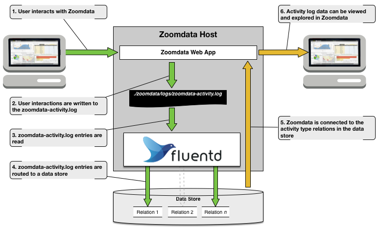

# Copyright (C) Zoomdata, Inc. 2012-2018. All rights reserved.

Sample utility for streaming Zoomdata's user activity log from the filesystem to a searchable data store. The utility is based on [Fluentd](https://www.fluentd.org/) running in [Docker](https://www.docker.com/) and minimizes dependencies required for installation.

## General Prerequisites:
* Zoomdata installed with [user activity logging enabled](https://www.zoomdata.com/docs/2.6/activity-logging.html)
* [Docker](https://www.docker.com/) installed on your Zoomdata host
* Internet access from the host where the Docker images will be built

## Getting Started:
1. Clone this repo to a working directory on your host
2. Navigate to this directory and execute `export HELPER_ROOT=$(pwd)` _(this will be handy later)_
3. Locate Zoomdata's installation directory, typically `/opt/zoomdata`, and set the `ZOOMDATA_INSTALL_ROOT` session variable to it. For example: `export ZOOMDATA_INSTALL_ROOT=/opt/zoomdata` _(this will be handy later too)_
4. Build the root Docker image: `docker build -t zoomdata/activity-log-helper $HELPER_ROOT`
5. Navigate to the appropriate README using the data store specific links (below) for further instruction.

## Data Stores Currently Supported:
* [PostgreSQL 9.5](outputs/postgres/README.md)
* [Elasticsearch 5.4](outputs/elasticsearch/README.md)